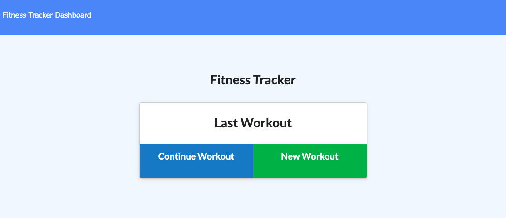
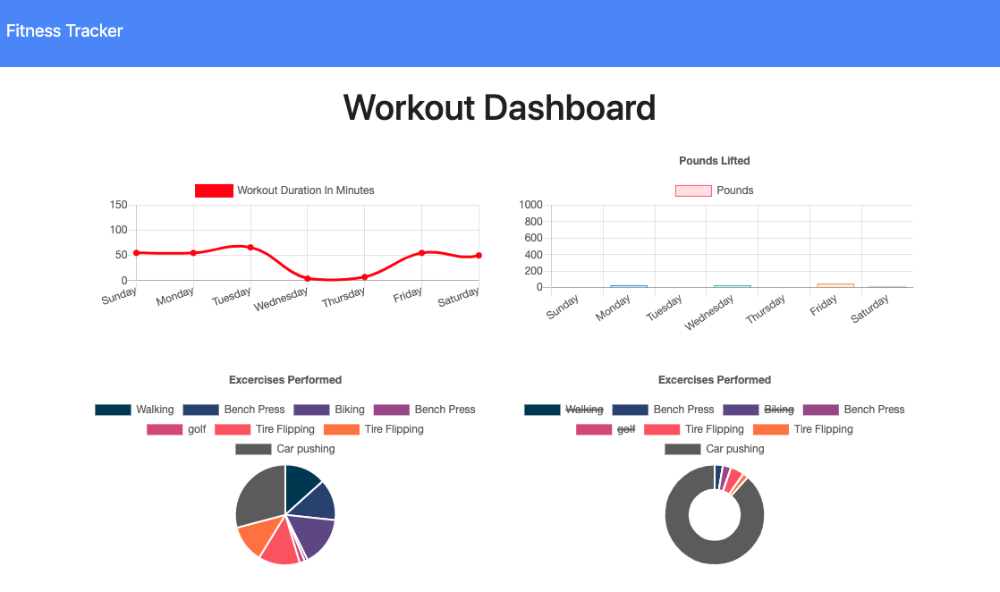

# WorkoutTracker

##Overview
For this assignment, you'll create a workout tracker. You have already been provided with the front end code in the Develop folder. This assignment will require you to create Mongo database with a Mongoose schema and handle routes with Express.

##User Story
As a user, I want to be able to view create and track daily workouts. I want to be able to log multiple exercises in a workout on a given day. I should also be able to track the name, type, weight, sets, reps, and duration of exercise. If the exercise is a cardio exercise, I should be able to track my distance traveled.

##Acceptance Criteria
When the user loads the page, they should be given the option to create a new workout or continue with their last workout.
The user should be able to:

Add exercises to a previous workout plan.

Add new exercises to a new workout plan.

View the combined weight of multiple exercises on the stats page.

##Installation
Run an npm install Run node server.js. In browser, open localhost:8080

##ScreenShots

##Links
https://github.com/RRenneke/WorkoutTracker